# CFG Mock Bank - My Identity & Access Management (IAM) Lab
This is my hands-on project where I am practicing how corporate networks and cloud security tools manage employee access to sensitive data. 

---

#  THE MAIN EVENT: WHAT I AM BUILDING THIS WEEKEND
My primary objective for Saturday and Sunday is to build an enterprise authentication hub focused on two high-yield industry standards:

* ** SETTING UP SINGLE SIGN-ON (SSO):** I will be connecting mock cloud applications straight to my Okta security hub. The goal is to make it so a bank employee only has to log in ONCE to securely unlock all of their corporate work portals without re-typing credentials.
* ** CREATING GROUP ACCESS CONTROLS:** I will be organizing my users into operational teams (like Bank Tellers vs. Loan Officers) to practice the Principle of Least Privilege—ensuring users can only open the specific banking apps required for their job description.

---

##  The Foundation (What I Completed on Friday)

### 1. Set Up My Local Server Environment
* **Installed VirtualBox:** I set up a virtual machine on my laptop so I have a separate, isolated mini-computer to act as my local bank server.
* **Installed Ubuntu Linux:** I deployed a lightweight Linux operating system onto that virtual machine to act as the bank's core basement database.
* **Configured Network Basics:** I made sure the server can connect to the internet safely so it's ready to handle user accounts.

• 
• 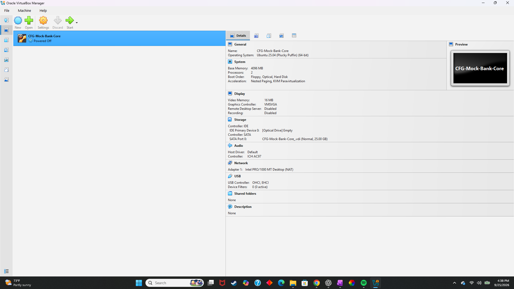

### 2. Set Up My Cloud Security Manager
* **Created a Free Okta Developer Account:** I set up an enterprise-grade Okta cloud security portal to manage user access profiles.
* **Created My First Users:** I practiced the onboarding process by manually adding user accounts (like myself and a test account for Othenial) into the cloud directory.
* **Verified Password Security Policies:** Checked my user list to ensure our corporate password rules are actively forcing safety checks on new accounts.

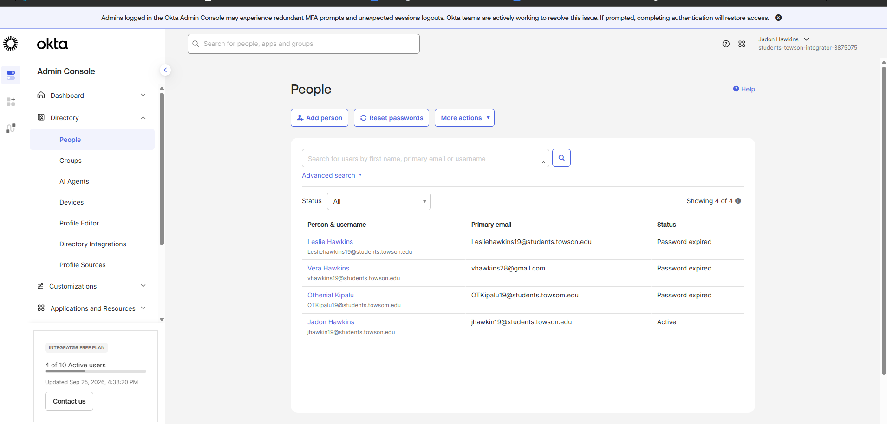

##  Phase 2 Architecture: Access Control & Federated SSO
Completed: Saturday, September 26, 2026

###  1. Role-Based Access Control (RBAC) 
* **What I Did:** I created a centralized security group called `SG-Branch-Operations`. This group represents a specific job "Role" at my bank (Retail Tellers). I dropped my mock users (like Keith and Othenial) into it.
* **Why it's an Access Control:** Instead of manually assigning apps to users one by one, I attached our custom banking portal app straight to the group. The users inherited access automatically **just because of their role in the company.**

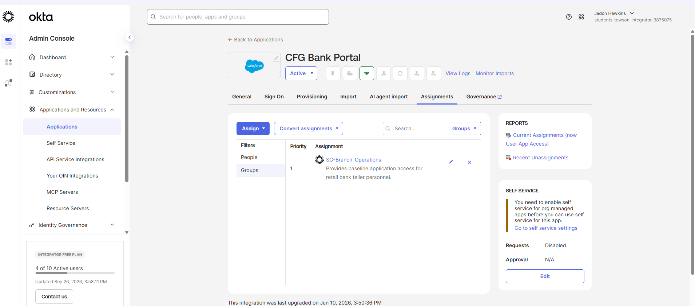

###  2. Single Sign-On (SSO) & Federation Handshake
* **What I Did:** I connected our customized `CFG Bank Portal` straight to my Okta cloud manager using the **SAML 2.0 federation engine**. 
* **How I Tested It:** I logged into the user dashboard as Keith and clicked the portal tile. It automatically compiled a secure cryptographic token and shot it across the internet straight to Salesforce's authentication firewall. 

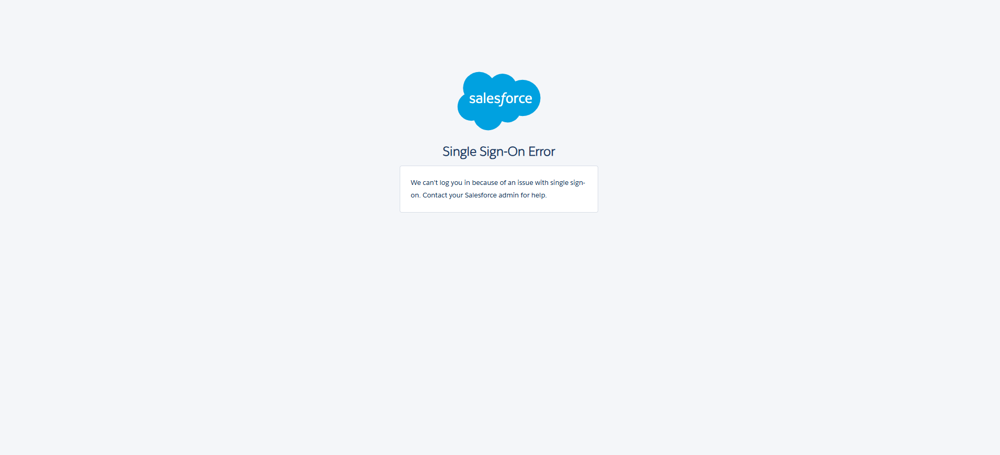

##  Phase 3 Architecture: Conditional Access Control & Geofencing
Completed: Sunday, September 27, 2026

###  1. Dynamic Network Perimeter Zoning
* **What I Did:** I created an enterprise-grade geolocation dynamic zone mapping explicit high-risk international perimeters (Russian Federation, Iran, North Korea).

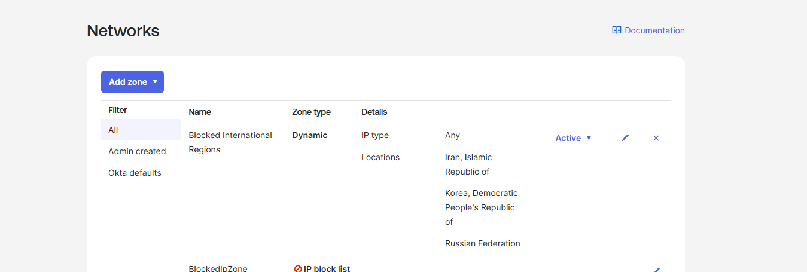

###  2. Conditional Access Policy Assignment
* **What I Did:** I architected an automated policy rule named `Block International Bank Intrusions` and dragged it to the top of the list at Priority 1 so it triggers first.
* **Why it's an Access Control:** It tracks incoming client IP properties. If a connection attempts to hit the portal from outside our authorized parameters, the system denies access immediately before they can even type a password.

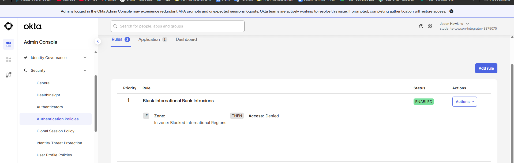

###  3. Intrusion Simulation Testing (Success Proof)
* **What I Did:** I routed a mock user session through an overseas VPN tunnel to simulate an unauthorized remote connection attempt.
* **The Result:** The Okta policy engine actively intercepted the handshake, immediately blocked the traffic, and threw a clean `403 Access Forbidden` denial wall.
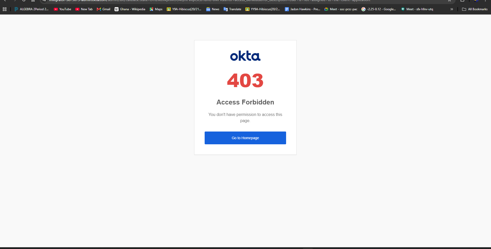

# CFG Mock Bank - Enterprise Network Identity Infrastructure
**Current Progress Date:** October 2, 2026  
**Active Weekend Objective:** Deploy an on-premises enterprise Windows Server environment, promote it to a master Active Directory Domain Controller, and write an automated PowerShell script to programmatically ingest bulk user data, eliminating tedious manual object provisioning.
##  Phase 1 Architecture: Enterprise Windows Infrastructure & Active Directory
* **The Goal:** Deploy the industry-standard corporate operating system, plant a fresh network data forest, and promote the machine to command network identities.
* **Windows Server Provisioning:** Built a brand new virtual machine named `CFG-Bank-DC01` (4GB RAM, 2 CPUs, 50GB Hard Drive) and installed **Windows Server 2022**. Installed Guest Additions display drivers so the interface stretches to full screen resolution cleanly.

* **Active Directory Forest Promotion:** Installed the core **Active Directory Domain Services (AD DS)** framework role and promoted the server to a **Domain Controller**. This officially crowned our network domain as `cfgmockbank.local`.
* **The Identity Upgrade:** The database promotion upgraded our local administrator account into a master network domain profile, changing our login gate prefix to **`CFGMOCKBANK\Administrator`**.

---

## ⚡ Phase 4 Architecture: Programmatic Lifecycle Automation & PowerShell Orchestration
Completed: Saturday, October 3, 2026

###  1. Core Directory Hierarchies (Organizational Units)
* **What I Did:** Bypassed the default system junk drawer container (`Users`) and created a dedicated root container called `Bank_Staff`. Inside it, I built a nested sub-folder drawer specifically for `Tellers`.
* **Why it's Best Practice:** Separating human bank employees from hidden network system accounts keeps our environment audit-ready. Placing the `Tellers` container inside `Bank_Staff` establishes inheritance, allowing us to enforce high-level security rules across the entire bank footprint later with a single policy line.

###  2. Advanced Parameter Splatting Automation Loop
* **What I Did:** Leveraged an AI co-pilot workflow to model a custom data generation loop, building a localized user profile spreadsheet (`C:\TellersList.csv`) right on the server disk core storage footprint.
* **Overcoming Technical Hurdles:** Faced text data corruption blocks where VirtualBox's clipboard system dropped code characters and critical dollar-sign (`$`) syntax variables. Solved the roadblock by engineering the loop with an advanced enterprise optimization model called **Parameter Splatting**.

* 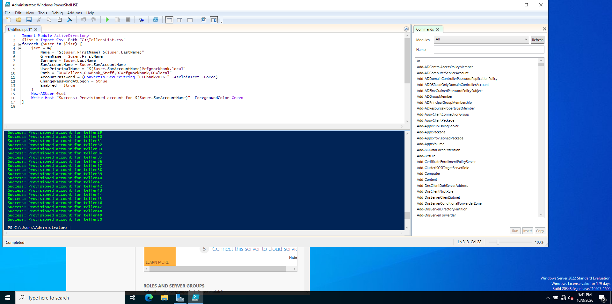
* **The Identity Automation Result:** Instead of wasting hours clicking menus 50 times, the automated PowerShell script packages the settings array into a tightly wrapped Hash Table, imports the file data, and programmatically provisions all 50 distinct corporate identities into our `Tellers` folder in under three seconds. Every account is assigned its unique login attributes, secure tracking tokens, and a mandatory first-time password change flag.

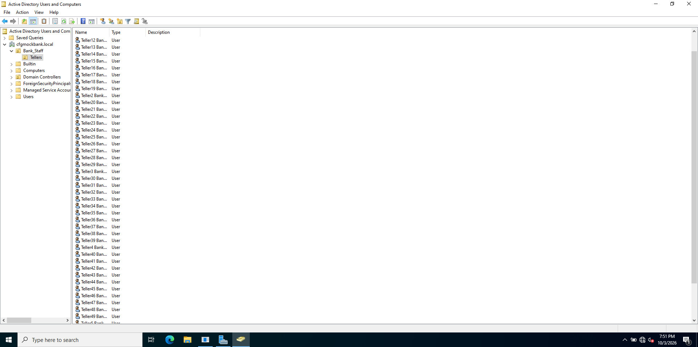

---

##  Phase 5 Architecture: Locking Down the System with Group Policies (GPOs)
**Completed:** Sunday, October 4, 2026

###  1. Why we use Group Policies (GPOs)
* **In Simple Words:** Now that we have 50 bank tellers in our system, we need to enforce safety rules. While folder structures (OUs) organize our users and Groups give them permissions, **Group Policies (GPOs)** are the master rules we set to lock down what users can and cannot do on their computers.

###  2. The 2 Safety Rules I Configured
* **The 3-Strike Lockout Rule (Brute-Force Defense):** I set a rule that says if anyone tries to guess a teller's password incorrectly **3 times in a row**, Active Directory will instantly freeze that account for **30 minutes**. This stops hackers from trying to guess passwords forever.
* **The 10-Minute Screen Lock (The Coffee Break Rule):** I set a rule that tracks if a computer is sitting empty. If a bank teller walks away from their desk and forgets to lock their screen, the server automatically locks the monitor after **600 seconds (10 minutes)** so random people can't look at customer bank data.

###  3. Forcing the System to Update
* **What I Did:** Group policies usually take a long time to turn on by themselves, so I opened up the Command Prompt terminal and ran a quick refresh command (`gpupdate /force`) to force the server to activate my new security rules instantly.

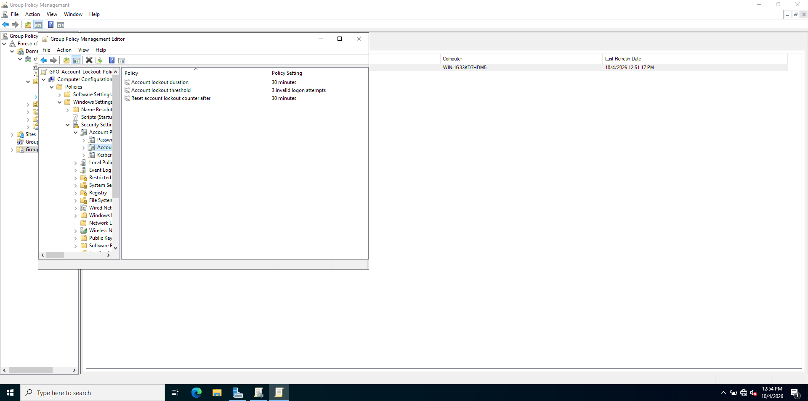
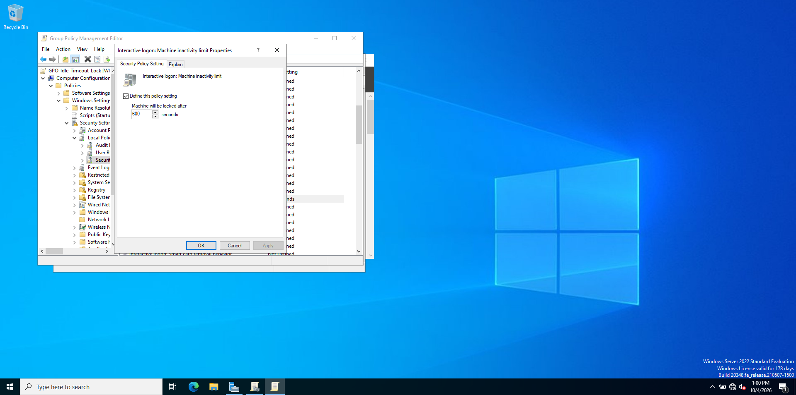

---

# 🚀 WEEKEND MILESTONE: ENTERPRISE LIFECYCLE AUTOMATION AT SCALE
**Current Milestone Date:** Friday, October 9, 2026  
**Active Weekend Objective:** Move out of the small-scale lab phase and prepare our network directory database to programmatically ingest, filter, and sort 3,000 active employee records across multiple banking role containers using automated scripts.

---

## 🏢 Phase 6 Architecture: Enterprise Data Scale, Staging, & Infrastructure Auditing

### 🗄️ 1. Self-Built Corporate Department Hierarchies (OUs)
* **What I Did:** Navigated the Active Directory tree console entirely on my own to expand our mock bank infrastructure. I built three brand new custom folder drawers (**Organizational Units**) under the main staff container: `Managers`, `Accounting`, and `HR`.
* **Why it's Crucial for Scaling:** To scale our database to 3,000 users, our upcoming automated script needs realistic corporate compartments to file accounts into. These folders give our script engine clean target paths to route employees based on their exact jobs.

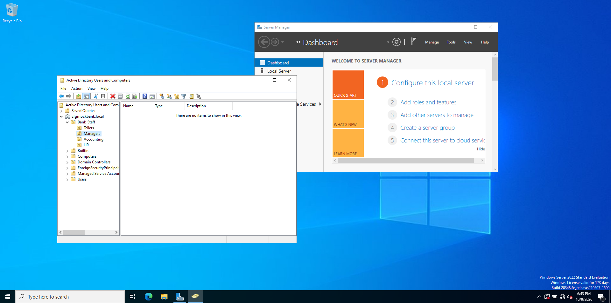

### 🩺 2. Enterprise Domain Controller Health Audit (DCDIAG)
* **What I Did:** Before dumping thousands of user records onto a server, a Systems Administrator must run a structural health check. I opened the administrative terminal and executed Microsoft's official health check engine: `dcdiag /v`. 
* **The Result:** I audited the live terminal logs to verify that our core infrastructure lifelines—including internal DNS routing paths, file system partitions, and Kerberos security token components—all returned successful `passed test` validation stamps. This proves our domain backbone is stable and fully prepped for heavy data migration stress tests tomorrow.

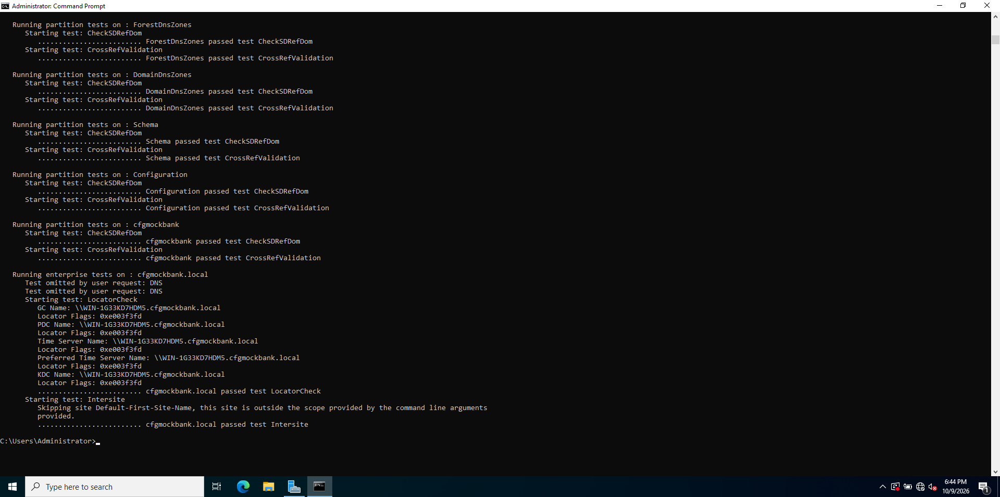
